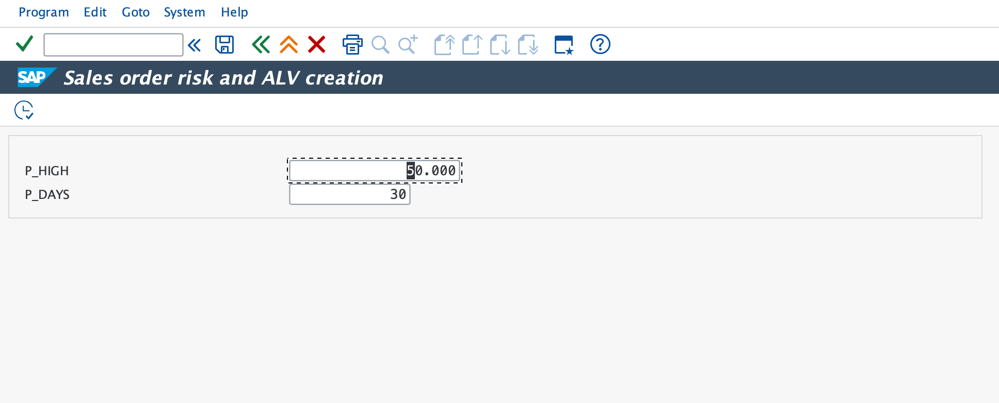
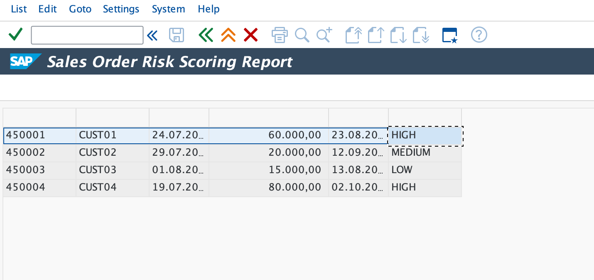

# 🚀 ABAP Project – Sales Order Risk Scoring Report

## 📌 Overview
This ABAP report analyzes **sales order data** (simulated using internal tables) and assigns a **risk classification** based on configurable thresholds.  
The results are displayed in a **SALV Grid Report** for easy viewing.

- **High Risk**: Very high order value (above threshold)  
- **Medium Risk**: Delivery date is far in the future (delayed)  
- **Low Risk**: Normal orders  

This project demonstrates **practical ABAP reporting skills** using internal tables, business rules, and ALV display.

---

## 🎯 Features
- Selection Screen with **risk parameters**:
  - `P_HIGH`: Order value threshold (default = 50,000)
  - `P_DAYS`: Delivery delay threshold (default = 30 days)
- Risk classification rules (`HIGH`, `MEDIUM`, `LOW`)
- Display results in **SALV Grid** (modern ALV)
- Covers important ABAP concepts:
  - Selection Screens  
  - Internal Tables and Work Areas  
  - LOOP / MODIFY logic  
  - Business Rule Implementation  
  - SALV Report Output  

---

## 🛠️ Technologies Used
- **SAP ABAP**  
- **SALV (Simple ALV)** for report output  
- Runs in **SAP NetWeaver AS ABAP Trial System (NPL)** or any SAP system with ABAP stack  

---

📌 **ALV Report**  

